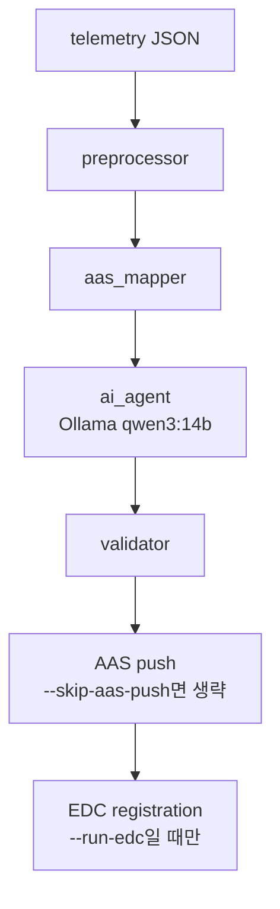
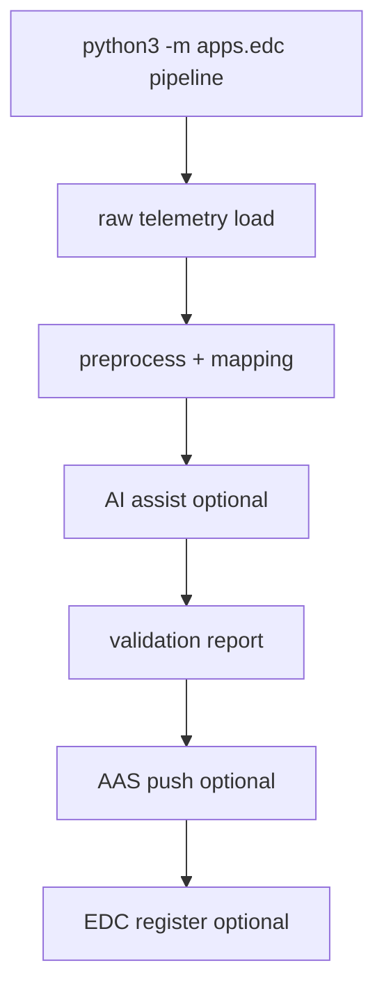
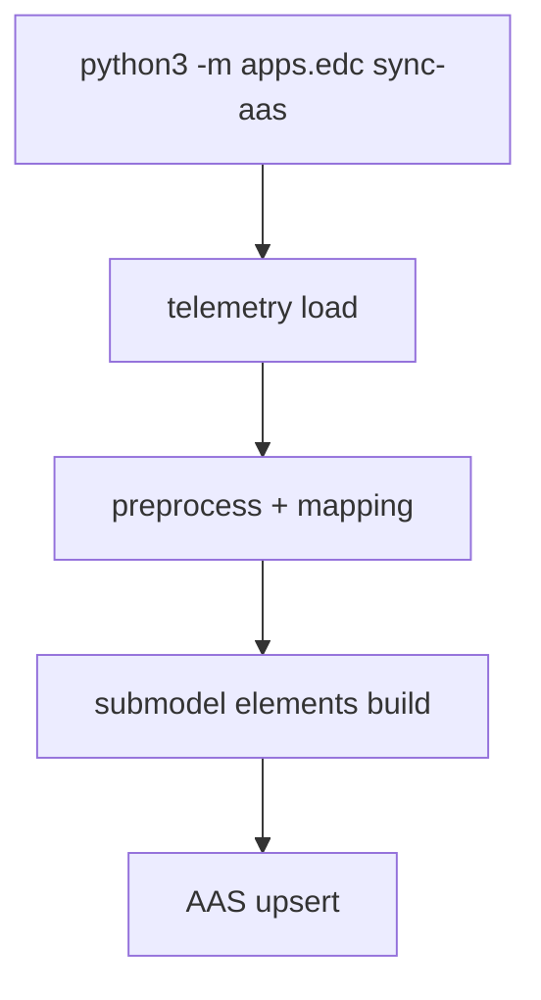
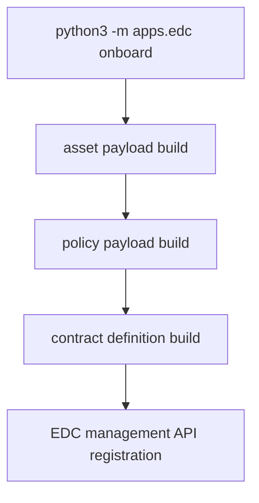
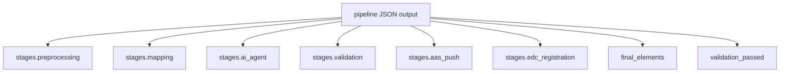

# EDC CLI Guide

CLI는 `apps.edc` 모듈로 실행합니다. 텔레메트리를 AAS/EDC 파이프라인으로 처리하는 도구입니다.

## 명령 구조

```bash
python3 -m apps.edc <command> [options]
```

| 명령 | 담당 |
| --- | --- |
| `pipeline` | 전처리 → 매핑 → AI 보조 → 검증 → AAS push → 선택적 EDC 등록 |
| `sync-aas` | telemetry JSON을 AAS Submodel로 변환해 AAS 저장소에 반영 |
| `onboard` | EDC asset/policy/contract definition 등록 |

## Pipeline 순서



## 명령별 흐름

### `pipeline`



### `sync-aas`



### `onboard`



## 자주 쓰는 명령

검증 중심 실행:

```bash
python3 -m apps.edc pipeline \
  --telemetry-json server/data/sample_telemetry.json \
  --telemetry-index 0 \
  --skip-aas-push
```

AAS 반영:

```bash
python3 -m apps.edc sync-aas \
  --telemetry-json server/data/sample_telemetry.json \
  --telemetry-index 0
```

EDC 등록:

```bash
python3 -m apps.edc onboard \
  --asset-id cobot-01 \
  --provider-bpn BPNL000000000001 \
  --cobot-api-base-url http://localhost:8080
```

## 환경변수

AI:

```bash
export OLLAMA_BASE_URL=http://localhost:11434
export OLLAMA_MODEL=qwen3:14b
export OLLAMA_TIMEOUT=120
```

AAS/EDC:

```bash
export CATENAX_AAS_BASE_URL=http://localhost:4001
export CATENAX_AAS_SUBMODEL_ID=urn:aas:cobot:submodel:001
export CATENAX_AAS_API_KEY=
export CATENAX_EDC_MANAGEMENT_URL=http://localhost:8181/management
export CATENAX_EDC_API_KEY=
```

기본 모델은 `apps/ai_agent.py` 기준 `qwen3:14b`입니다.

## 출력

`pipeline`은 단계별 결과를 JSON으로 출력합니다.


