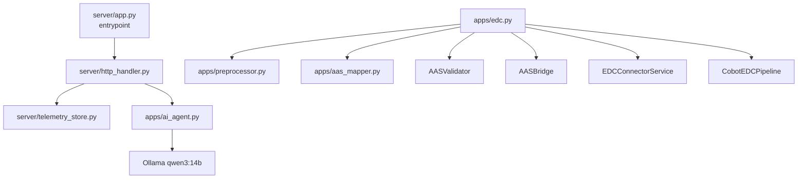
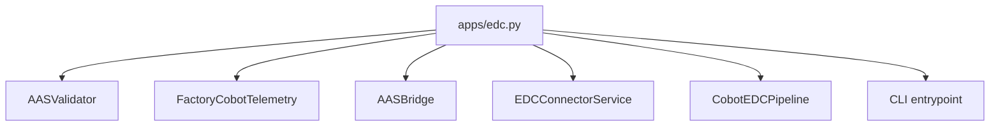
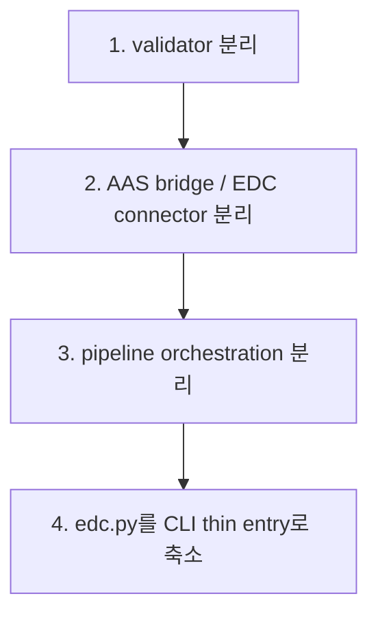

# Refactor Notes

현재 구조에서 이미 분리된 책임과, 다음에 분리하면 좋은 대상을 정리합니다.

## 현재 구조 맵

## 현재 반영된 분리

| 영역 | 현재 위치 | 상태 |
| --- | --- | --- |
| 서버 실행 | `server/app.py` | 진입점만 담당 |
| 서버 라우팅 | `server/http_handler.py` | 분리 완료 |
| 저장/조회/KPI | `server/telemetry_store.py` | 분리 완료 |
| 서버 설정 | `server/settings.py` | 경로/필수 필드/logger 담당 |
| 전처리 | `apps/preprocessor.py` | 분리 완료 |
| AAS 매핑 | `apps/aas_mapper.py`, `apps/semantic_map.json` | 분리 완료 |
| AI Agent | `apps/ai_agent.py` | 분리 완료 |

## 아직 큰 파일

`apps/edc.py`는 아래 책임을 함께 갖고 있습니다.

## 다음 리팩터 후보

| 후보 파일 | 옮길 책임 |
| --- | --- |
| `apps/validator.py` | `AASValidator`, `ValidationReport` |
| `apps/aas_bridge.py` | `FactoryCobotTelemetry`, `AASBridge` |
| `apps/edc_connector.py` | `EDCAsset`, `EDCPolicy`, `ContractDefinition`, `EDCConnectorService` |
| `apps/pipeline.py` | `CobotEDCPipeline` |
| `apps/edc.py` | CLI 진입점만 유지 |

## 우선순위

1. `apps/edc.py`에서 validator 분리
2. AAS bridge와 EDC connector 분리
3. pipeline orchestration 분리
4. CLI는 얇게 유지

현재 기능이 깨지지 않게 하려면 한 번에 전부 나누지 말고 위 순서로 이동하는 것이 안전합니다.
