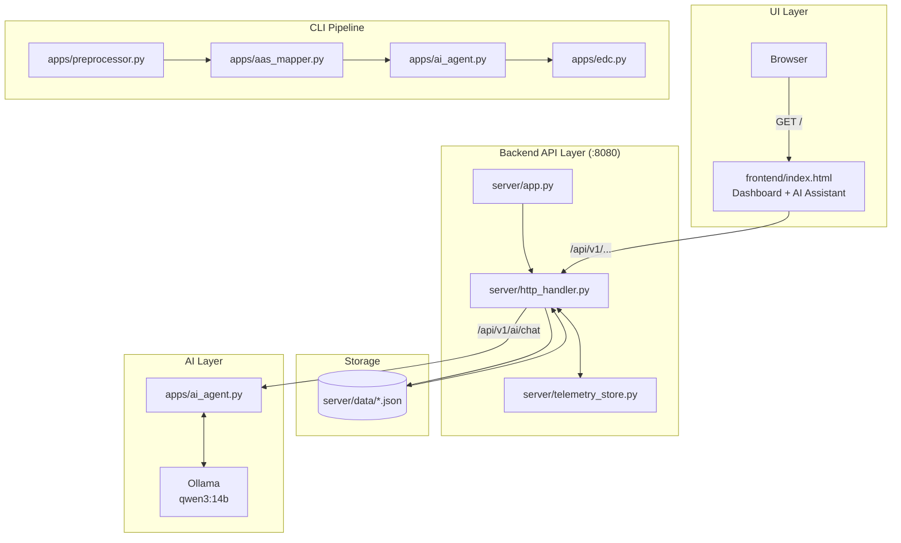
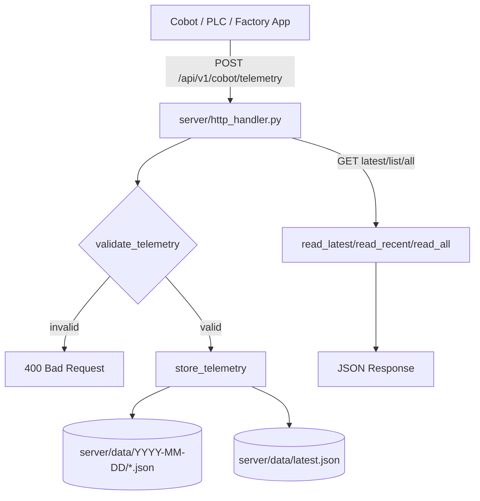
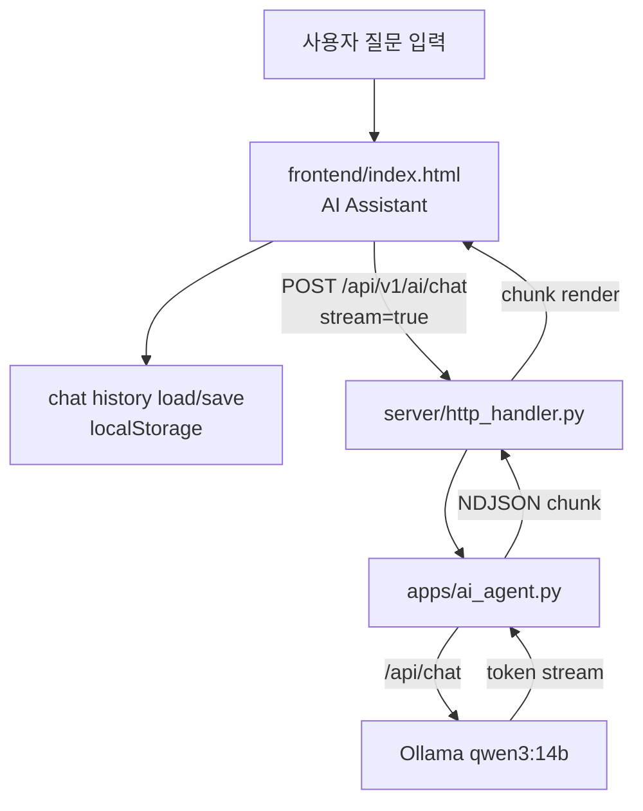
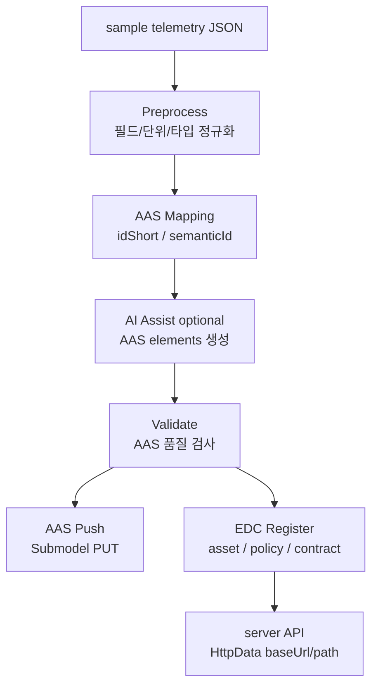

# Catena-X Cobot Data Space

협동로봇 텔레메트리를 수집하고, 대시보드/AI 질의응답/AAS-EDC 파이프라인으로 확인하는 데모 프로젝트입니다.


## 실행

```bash
# 1) 백엔드(API)
python3 server/app.py --host 127.0.0.1 --port 8080

# 2) 프런트(UI)
cd frontend
python3 -m http.server 3000 --bind 127.0.0.1
```

- UI: `http://localhost:3000/`
- API: `http://localhost:8080/`
- 참고: `http://localhost:8080/`도 `frontend/index.html`을 반환합니다.

## 전체 아키텍처 흐름



## 실시간 텔레메트리 수집



## AI 질의응답(스트리밍)



## 온보딩/EDC 파이프라인

`server`는 telemetry 데이터 제공 API이고, `apps.edc`는 그 API를 AAS/EDC 자산으로 등록하는 CLI 파이프라인입니다.



EDC 등록 시 생성되는 구조는 `EDCAsset` → `EDCPolicy` 2개(access/contract) → `ContractDefinition` 순서입니다. Asset의 `dataAddress`는 `http://localhost:8080` 같은 서버 주소와 `/api/v1/cobot/telemetry` path를 가리킵니다.

## 주요 기능

- `frontend/index.html`: 운영 대시보드, 차트, AI 어시스턴트 화면
- `frontend/index.html`: AI 채팅 히스토리(localStorage, 최대 100개) 저장/복원
- `server/app.py`: 서버 실행 진입점
- `server/http_handler.py`: HTTP 라우팅, API 응답
- `server/telemetry_store.py`: 텔레메트리 검증, 저장, 조회, KPI/시계열 집계
- `apps/ai_agent.py`: Ollama health/chat/streaming/AAS 생성 보조
- `apps/edc.py`: AAS 검증, AAS push, EDC 등록, CLI 파이프라인

## 주요 API

- `GET /health`
- `GET /api/v1/cobot/telemetry/all`
- `GET /api/v1/cobot/telemetry/latest`
- `GET /api/v1/cobot/telemetry/kpi/summary`
- `GET /api/v1/cobot/telemetry/timeseries`
- `GET /api/v1/ai/health`
- `POST /api/v1/ai/chat`

## CLI

```bash
python3 -m apps.edc --help
python3 -m apps.edc pipeline --telemetry-json server/data/sample_telemetry.json --skip-aas-push
```

필요한 환경변수:

```bash
export OLLAMA_BASE_URL=http://localhost:11434
export OLLAMA_TIMEOUT=120

export CATENAX_AAS_BASE_URL=http://localhost:4001
export CATENAX_AAS_SUBMODEL_ID=urn:aas:cobot:submodel:001
export CATENAX_EDC_MANAGEMENT_URL=http://localhost:8181/management
```

참고:
- 서버(`server/settings.py`) 기준 모델은 현재 `qwen3:14b`로 고정입니다.

## 문서

- `server/PIPELINE.md`: 서버 API와 EDC 데이터 제공 흐름
- `apps/PIPELINE.md`: AAS/EDC/AI 파이프라인 세부 구조
- `EDC_CLI_GUIDE.md`: CLI 사용법과 payload 예시
- `EDC_REFACTOR_PROPOSAL.md`: 현재 구조 기준 리팩터링 메모
