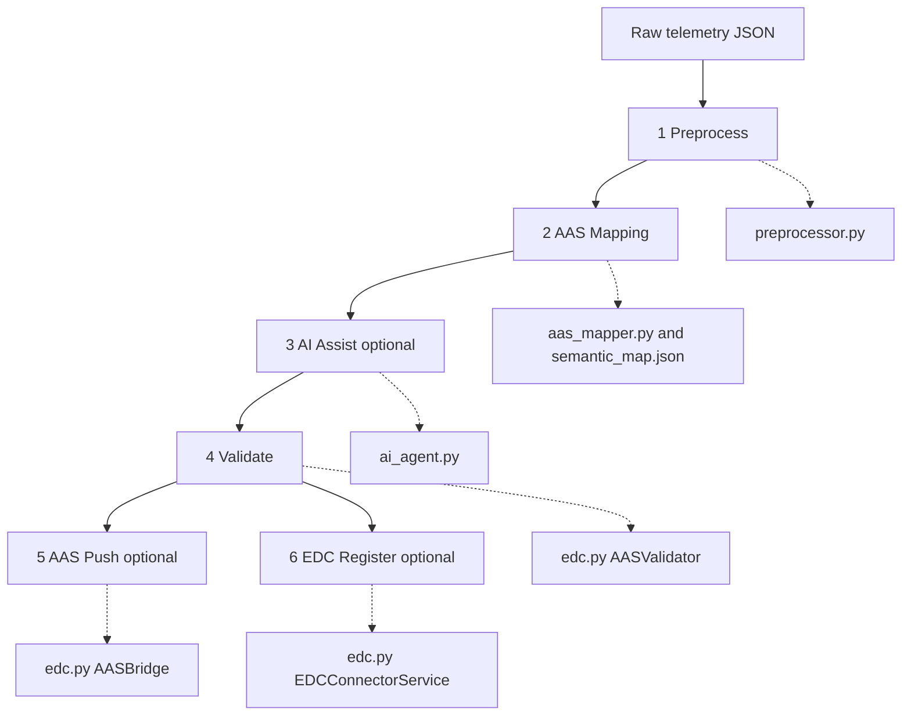
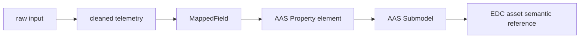
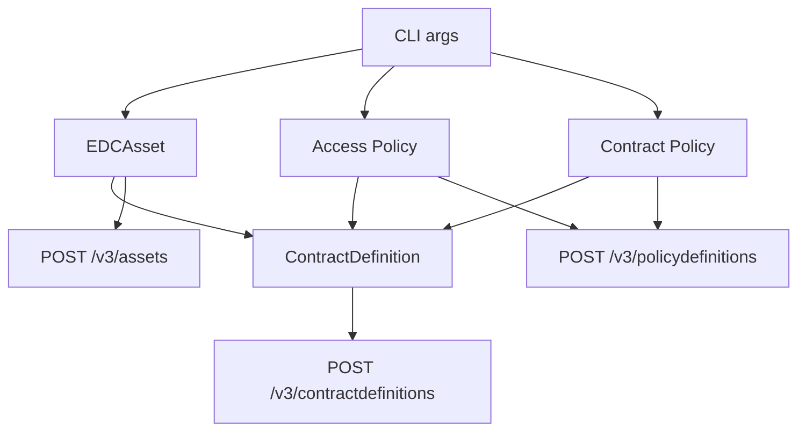
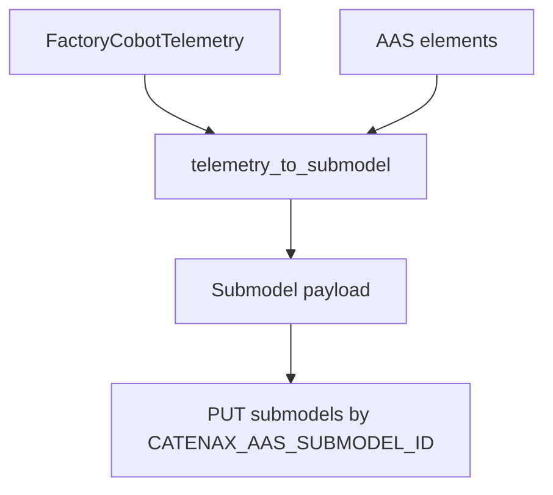
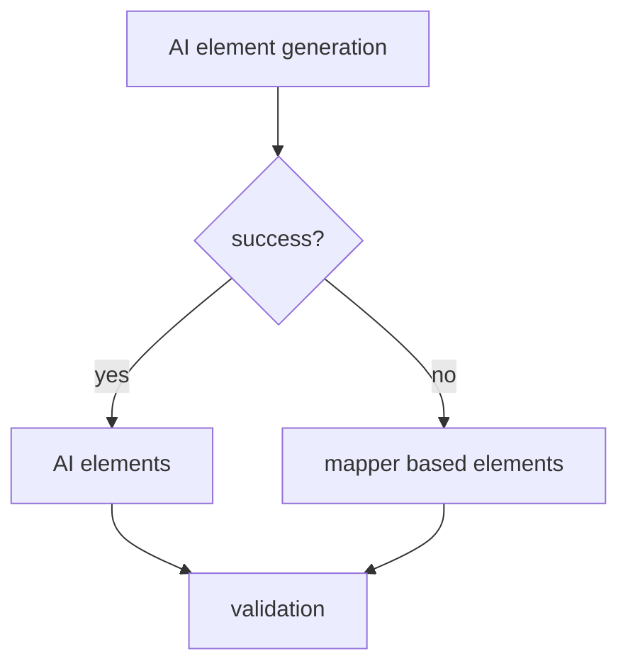

# Apps Pipeline

`apps`는 코봇 telemetry를 AAS Submodel로 정리하고, 필요하면 EDC Connector에 데이터 자산으로 등록하는 CLI 파이프라인입니다. 서버(`server`)는 telemetry API를 제공하고, `apps`는 그 데이터를 Catena-X/AAS/EDC 형태로 가공합니다.

## 한눈에 보는 흐름



오케스트레이션은 `apps/edc.py::CobotEDCPipeline.run_full_pipeline()`이 담당합니다.

## 파일별 책임

| 파일 | 담당 |
| --- | --- |
| `preprocessor.py` | 필드 alias, 단위, 타입, status, timestamp 정규화 |
| `aas_mapper.py` | telemetry key를 AAS `idShort`, `semanticId`, `valueType`으로 변환 |
| `semantic_map.json` | 표준 필드의 AAS semantic mapping 테이블 |
| `ai_agent.py` | Ollama 기반 metamodel 추론, AAS element/code 생성, 검증 설명 |
| `edc.py` | AAS 검증, AAS push, EDC 등록, CLI, 전체 파이프라인 조율 |

## 단계별 입력과 출력

| 단계 | 입력 | 처리 | 출력 |
| --- | --- | --- | --- |
| 1. Preprocess | 원본 telemetry dict | camelCase→snake_case, 단위 변환, 기본값 보강 | 정규화 dict + warnings |
| 2. AAS Mapping | 정규화 dict | `semantic_map.json` 기준 매핑, 미등록 필드는 `custom:catenax:*` | `MappedField[]` |
| 3. AI Assist | `MappedField[]`, alarms, program | metamodel 추론, AAS Property 생성, 코드 힌트 생성 | AAS elements 또는 fallback |
| 4. Validate | AAS elements, 정규화 telemetry | 필수 Property, semanticId, 값 일관성 검사 | `ValidationReport` |
| 5. AAS Push | telemetry + elements | AAS Submodel payload 생성 후 PUT | AAS Repository 응답 |
| 6. EDC Register | asset id, BPN, server URL | asset/policy/contract 등록 | EDC Management API 응답 |

## 데이터 변환 구조



핵심 객체는 다음처럼 이어집니다.

| 객체 | 위치 | 의미 |
| --- | --- | --- |
| `PreprocessingResult.cleaned` | `preprocessor.py` | 파이프라인 표준 telemetry dict |
| `MappedField` | `aas_mapper.py` | AAS Property 생성을 위한 중간 표현 |
| `ValidationReport` | `edc.py` | AAS 품질 검사 결과 |
| `FactoryCobotTelemetry` | `edc.py` | AAS Submodel 생성용 telemetry 모델 |
| `EDCAsset` / `EDCPolicy` / `ContractDefinition` | `edc.py` | EDC 등록 payload 모델 |

## EDC 등록 구조

EDC 등록은 `--run-edc`가 있고 `--asset-id`, `--provider-bpn`, `--cobot-api-base-url`이 모두 있을 때만 실행됩니다.



| 구성요소 | 생성 규칙 | 설명 |
| --- | --- | --- |
| Asset | `asset_id` | 코봇 telemetry API를 EDC 자산으로 등록 |
| DataAddress | `baseUrl=cobot_api_base_url`, `path=/api/v1/cobot/telemetry` | EDC가 프록시할 서버 API 위치 |
| Access Policy | `{asset_id}-access-policy` | 카탈로그/접근 가능 조건 |
| Contract Policy | `{asset_id}-contract-policy` | 계약 후 사용 가능 조건 |
| Contract Definition | `{asset_id}-contract` | asset과 두 policy를 연결 |

현재 정책은 `BusinessPartnerNumber EQ provider_bpn` 조건의 `USE` permission입니다. 데모에는 충분하지만, 운영 환경에서는 사용 목적, 기간, credential, participant allow-list 같은 제약을 더 넣어야 합니다.

## AAS Push 구조



`AASBridge`는 `CATENAX_AAS_BASE_URL`과 `CATENAX_AAS_SUBMODEL_ID`를 사용합니다. `CATENAX_AAS_API_KEY`가 있으면 요청 헤더에 포함합니다.

## Fallback

- AI Agent가 없거나 Ollama 호출이 실패하면 mapper 결과로 rule-based AAS elements를 만듭니다.
- `--skip-aas-push`를 주면 AAS Repository 반영을 생략합니다.
- `--run-edc`를 주지 않으면 EDC 등록은 생략합니다.
- EDC 등록에는 connector와 AAS bridge 설정이 모두 필요합니다.



## 실행 예시

검증만 빠르게 확인:

```bash
python3 -m apps.edc pipeline \
  --telemetry-json server/data/sample_telemetry.json \
  --telemetry-index 0 \
  --skip-aas-push
```

AAS와 EDC까지 실행:

```bash
python3 -m apps.edc pipeline \
  --telemetry-json server/data/sample_telemetry.json \
  --telemetry-index 0 \
  --run-edc \
  --asset-id cobot-01 \
  --provider-bpn BPNL000000000001 \
  --cobot-api-base-url http://localhost:8080
```

필수 환경변수:

```bash
export CATENAX_AAS_BASE_URL=http://localhost:4001
export CATENAX_AAS_SUBMODEL_ID=urn:aas:cobot:submodel:001
export CATENAX_EDC_MANAGEMENT_URL=http://localhost:8181/management
export CATENAX_EDC_API_KEY=
```

## 결과 확인 포인트

`pipeline` 출력에서는 아래 필드를 먼저 보면 됩니다.

| 필드 | 확인 내용 |
| --- | --- |
| `stages.preprocessing.warnings` | 입력 보정 내용 |
| `stages.mapping.field_count` | AAS로 매핑된 필드 수 |
| `stages.ai_agent.status` | AI 사용/ fallback 여부 |
| `stages.validation.passed` | AAS 검증 통과 여부 |
| `stages.aas_push.status` | AAS 반영 여부 |
| `stages.edc_registration.status` | EDC 등록 여부 |
| `final_elements` | 최종 AAS Property 배열 |
