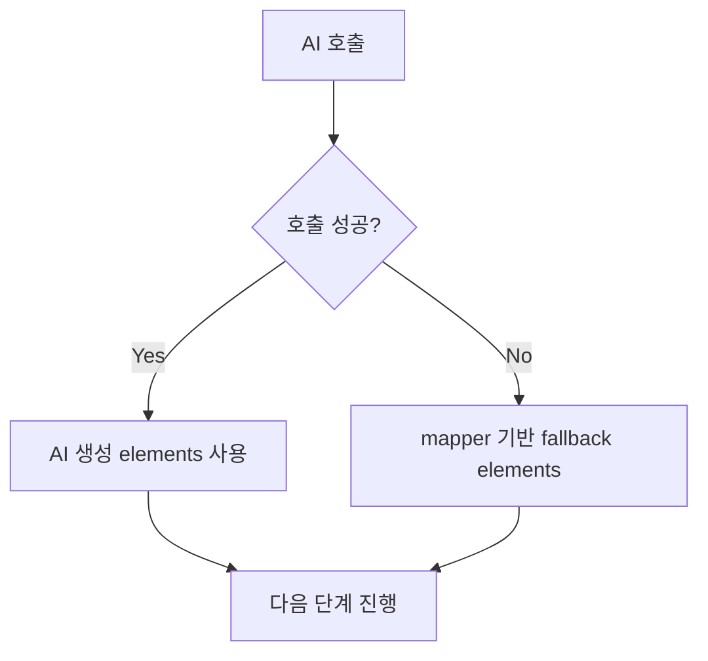
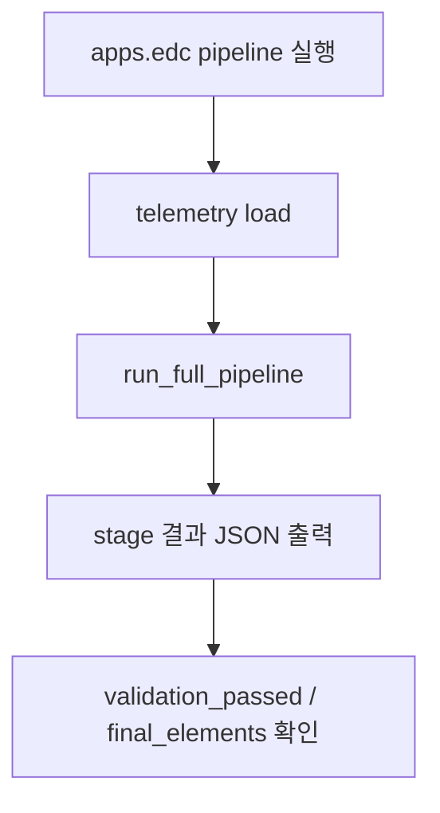

# Apps Pipeline

`apps`는 텔레메트리를 AAS/EDC 흐름으로 변환하는 파이프라인 영역입니다.
프런트 AI 화면의 채팅 히스토리는 `frontend/index.html`에서 `localStorage`로 저장/복원합니다(최대 100개).

## 실행 흐름

```mermaid
flowchart TD
    RAW[Raw telemetry JSON] --> P[1) Preprocess<br/>apps/preprocessor.py]
    P --> M[2) AAS Mapping<br/>apps/aas_mapper.py + semantic_map.json]
    M --> AI[3) AI Assist<br/>apps/ai_agent.py]
    AI --> V[4) Validate<br/>apps/edc.py::AASValidator]
    V --> AP[5) AAS Push<br/>apps/edc.py::AASBridge]
    AP --> ER[6) EDC Register<br/>apps/edc.py::EDCConnectorService]
```

오케스트레이션은 `apps/edc.py::CobotEDCPipeline.run_full_pipeline()`이 담당합니다.

## 파일별 책임

| 파일 | 담당 |
| --- | --- |
| `preprocessor.py` | 필드명/단위/타입/status/timestamp 정규화 |
| `aas_mapper.py` | telemetry field를 AAS `idShort`, `semanticId`, `valueType`으로 매핑 |
| `semantic_map.json` | 기본 AAS semantic mapping 테이블 |
| `ai_agent.py` | Ollama health/chat/streaming, validation 설명, AAS element/code 생성 보조 |
| `edc.py` | 검증, AAS push, EDC 등록, CLI, 전체 파이프라인 조율 |

## 단계별 산출물

| 단계 | 입력 | 출력 |
| --- | --- | --- |
| Preprocess | 원본 telemetry | 정규화된 dict |
| Mapper | 정규화 dict | `MappedField[]` |
| AI Assist | `MappedField[]`, alarms 등 | metamodel, AAS elements, 생성 코드 |
| Validator | AAS elements, 원본 telemetry | `ValidationReport` |
| AAS Push | telemetry + elements | AAS Submodel PUT 결과 |
| EDC Register | asset/policy/contract 정보 | EDC management API 결과 |

```mermaid
flowchart TD
    I1[Preprocess] --> O1[정규화 telemetry dict]
    O1 --> I2[Mapper]
    I2 --> O2[MappedField[]]
    O2 --> I3[AI Assist]
    I3 --> O3[metamodel / AAS elements / code hint]
    O3 --> I4[Validator]
    I4 --> O4[ValidationReport]
    O4 --> I5[AAS Push]
    I5 --> O5[AAS upsert result]
    O5 --> I6[EDC Register]
    I6 --> O6[asset/policy/contract registration result]
```

## Fallback

- AI Agent가 없거나 Ollama 호출이 실패하면 mapper 결과로 rule-based AAS elements를 만듭니다.
- AAS push는 `--skip-aas-push`로 건너뛸 수 있습니다.
- EDC 등록은 `--run-edc`와 필수 인자가 있을 때만 실행됩니다.



## CLI 예시

```bash
python3 -m apps.edc pipeline \
  --telemetry-json server/data/sample_telemetry.json \
  --telemetry-index 0 \
  --skip-aas-push
```


