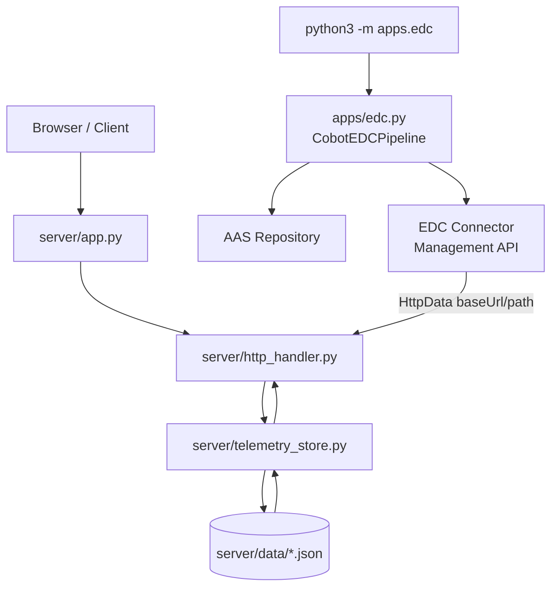
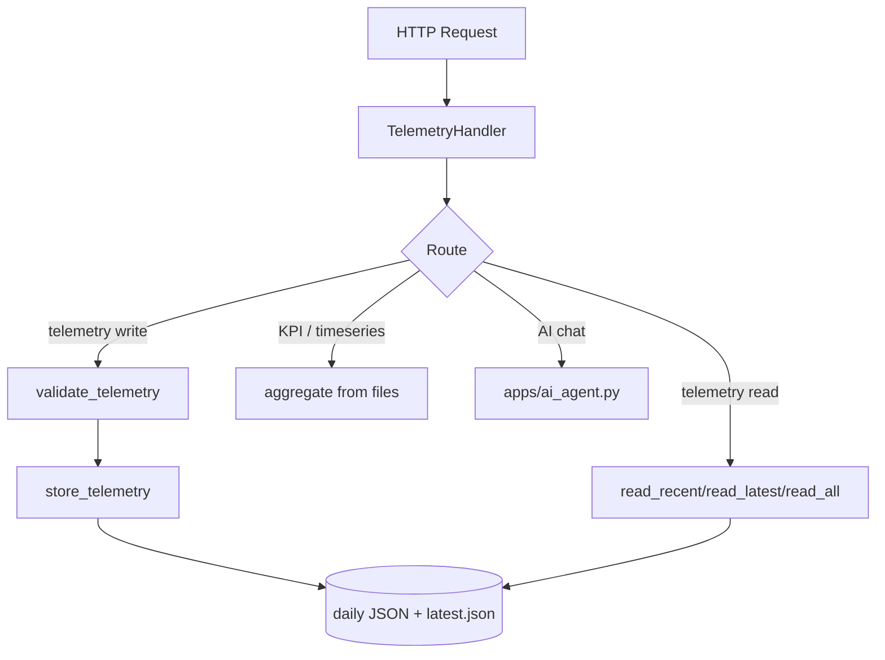
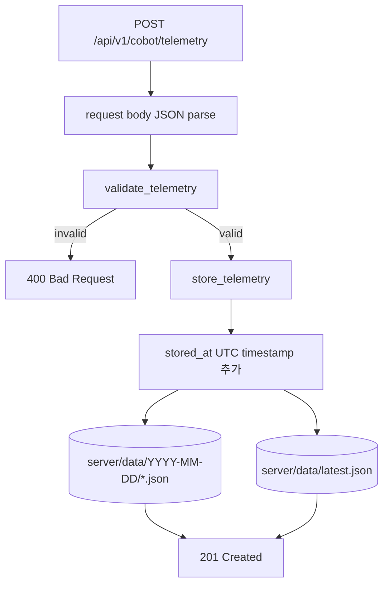
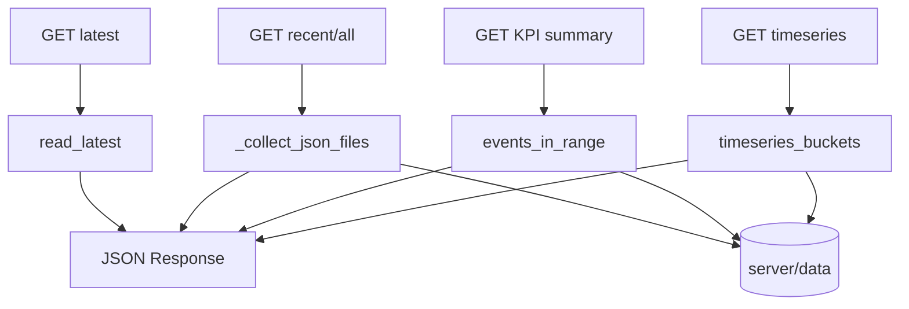
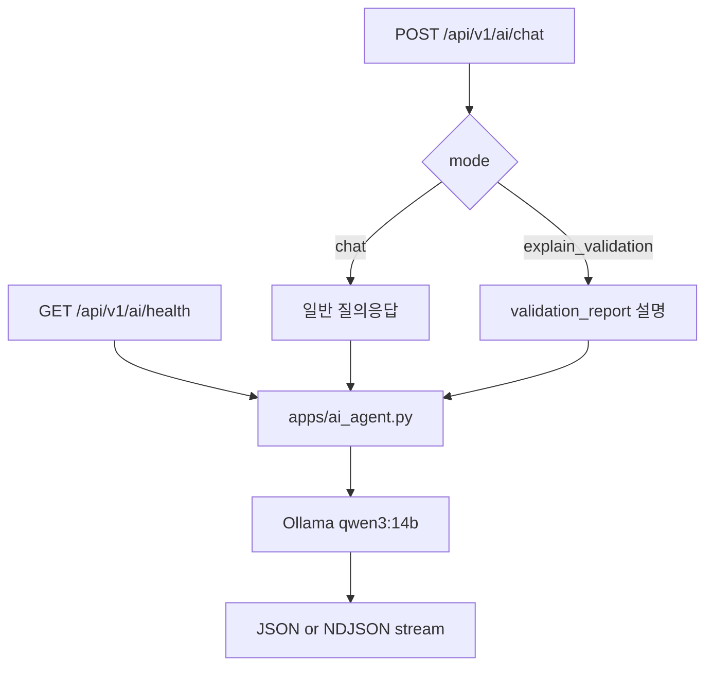
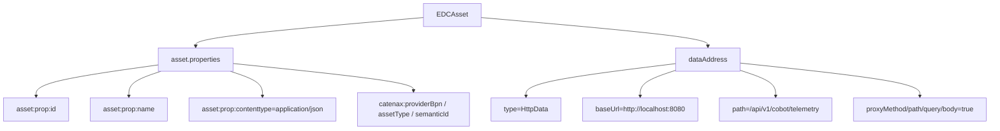
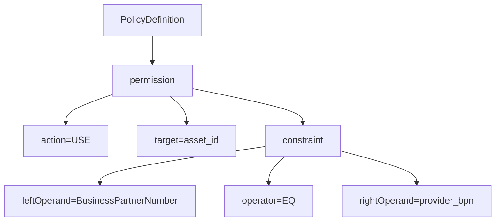
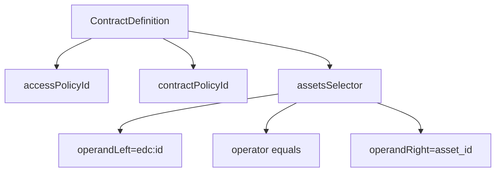
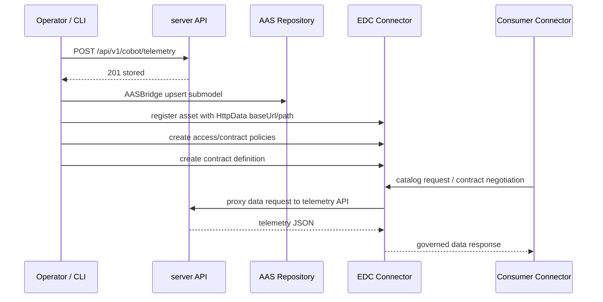

# Server Pipeline

`server`는 `8080`에서 코봇 텔레메트리 JSON API를 제공합니다. UI는 `3000` 정적 서버에서 제공할 수 있고, `server`는 `/`에 `frontend/index.html`을, `/ai.html`·`/edc.html`·`/css/*`·`/js/*` 등에 `frontend/` 정적 파일을 반환합니다.

EDC 관점에서 이 서버는 **EDC Connector 자체가 아니라 데이터 제공 API(Data Provider API)** 입니다. `apps.edc`가 EDC에 `HttpData` asset을 등록할 때 `baseUrl`로 이 서버 주소를, `path`로 `/api/v1/cobot/telemetry` 같은 조회 API를 지정합니다.

## 전체 구조



서버 내부 흐름은 단순합니다.



## 파일별 책임

| 파일 | 담당 |
| --- | --- |
| `app.py` | 서버 실행 진입점, `ThreadingHTTPServer` 시작, 데이터 디렉토리 보장 |
| `http_handler.py` | 라우팅, CORS, JSON/NDJSON 응답, AI API 연결 |
| `telemetry_store.py` | telemetry 검증, 파일 저장, 조회, KPI/시계열 계산 |
| `settings.py` | 경로, 필수 필드, logger 설정 |
| `data/` | 저장된 telemetry JSON과 `latest.json` |

## API 표면

| Method | Path | 설명 |
| --- | --- | --- |
| `GET` | `/` 또는 `/index.html` | 프런트엔드 대시보드 HTML 반환 |
| `GET` | `/ai.html`, `/edc.html`, `/css/*.css`, `/js/*.js` | `frontend/` 이하 동일 경로의 정적 파일(화면 분리·공통 리소스) |
| `GET` | `/health` | 서버 상태 확인 |
| `POST` | `/api/v1/cobot/telemetry` | telemetry 저장 |
| `GET` | `/api/v1/cobot/telemetry?limit=20` | 최근 telemetry 조회, 최대 `500` |
| `GET` | `/api/v1/cobot/telemetry/latest` | 최신 telemetry 1건 조회 |
| `GET` | `/api/v1/cobot/telemetry/all` | 저장된 telemetry 전체 조회, 내부 limit `10000` |
| `GET` | `/api/v1/cobot/telemetry/kpi/summary?window=1h&compare=previous` | KPI 요약 및 이전 구간 비교 |
| `GET` | `/api/v1/cobot/telemetry/timeseries?from=...&to=...&bucket=5m` | 시계열 버킷 집계 |
| `GET` | `/api/v1/ai/health` | Ollama 기반 AI Agent 상태 확인 |
| `POST` | `/api/v1/ai/chat` | AI 채팅/검증 설명 요청, 선택적으로 NDJSON 스트리밍 |

필수 telemetry 필드는 `settings.py::REQUIRED_FIELDS` 기준입니다.

| 필드 | 설명 |
| --- | --- |
| `robot_id` | 코봇 또는 로봇 식별자 |
| `line_id` | 생산 라인 식별자 |
| `station_id` | 공정/스테이션 식별자 |
| `cycle_time_ms` | 사이클 타임, 숫자 |
| `power_watts` | 전력 사용량, 숫자 |
| `program_name` | 실행 중인 프로그램명 |
| `status` | `RUNNING`, `WARNING`, `ERROR` 등 상태값 |

## 저장 흐름



`store_telemetry`는 원본 payload를 복사한 뒤 `stored_at`을 추가합니다. 파일명은 `stored_at`과 `robot_id`를 조합해 만들며, 같은 시점의 최신 데이터는 `latest.json`에도 덮어씁니다. 쓰기 구간은 `STORE_LOCK`으로 보호합니다.

## 조회와 집계



KPI는 지정한 window의 이벤트를 파일에서 읽어 계산합니다. 현재 지원 window는 `15m`, `1h`, `24h`, `7d`이고, `compare=previous`가 기본값입니다. 시계열 bucket은 `1m`, `5m`, `15m`, `1h`를 지원하며 조회 범위는 최대 14일입니다.

알림 판단은 `telemetry_store.py::robot_has_alert`에서 수행합니다. `status`가 `ERROR`, `FAULT`, `WARNING`이거나, 온도 `75.0°C` 초과, 진동 `5.0 mm/s` 초과, 불량률 `2%` 초과, `alarms` 배열이 비어 있지 않은 경우 alert로 계산합니다.

## AI 흐름



프런트 AI 화면은 대화 히스토리를 브라우저 `localStorage`에 저장하며, 재접속 시 자동 복원합니다. 저장 개수는 최대 100개 메시지입니다.

AI 모델 기본값은 `qwen3:14b`입니다.

## EDC 세부 구조

현재 EDC 등록 로직은 `server`가 아니라 `apps/edc.py`에 있습니다. 서버 문서에서 EDC를 함께 설명하는 이유는 EDC asset의 실제 데이터 주소가 `server` API를 가리키기 때문입니다.

```mermaid
flowchart LR
    RAW[Telemetry JSON] --> PRE[Preprocessor]
    PRE --> MAP[AAS Mapper]
    MAP --> AI[AI Assist optional]
    AI --> VAL[AASValidator]
    VAL --> AAS[AASBridge<br/>PUT /submodels/{id}]
    VAL --> REG[EDCConnectorService]
    REG --> ASSET[/v3/assets]
    REG --> POL[/v3/policydefinitions]
    REG --> CONTRACT[/v3/contractdefinitions]
    ASSET --> SERVER[server API<br/>HttpData baseUrl/path]
```

`apps.edc`의 EDC 관련 객체는 아래 4개로 나뉩니다.

| 객체 | 역할 | 주요 값 |
| --- | --- | --- |
| `EDCAsset` | EDC에 공개할 데이터 자산 정의 | `asset_id`, `name`, `content_type`, `base_url`, `data_path`, `properties` |
| `EDCPolicy` | 자산 접근/계약 정책 정의 | `policy_id`, `assignee`, `target`, `action=USE`, `BusinessPartnerNumber EQ ...` |
| `ContractDefinition` | asset과 access/contract policy를 묶음 | `contract_definition_id`, `accessPolicyId`, `contractPolicyId`, asset selector |
| `EDCConnectorService` | EDC Management API 호출 래퍼 | asset 등록, policy 생성, contract definition 생성, catalog 요청, contract negotiation |

### EDCAsset

`EDCAsset`은 데이터가 어디에 있고 어떤 속성을 갖는지 정의합니다. 이 프로젝트에서는 코봇 telemetry API가 데이터 원천입니다.



`dataAddress`의 `baseUrl`과 `path`가 이 서버와 직접 연결되는 지점입니다. 예를 들어 `--cobot-api-base-url http://localhost:8080`으로 온보딩하면, EDC는 `HttpData` 주소로 `http://localhost:8080`과 `/api/v1/cobot/telemetry`를 등록합니다.

### EDCPolicy

`EDCPolicy`는 ODRL 형태의 `PolicyDefinition`을 생성합니다. 기본 동작은 특정 Business Partner Number에 대해 `USE` 권한을 허용하는 구조입니다.



현재 구현은 데모에 맞춘 단순 정책입니다. 운영 환경에서는 사용 목적, 기간, 데이터 사용 제한, participant allow-list, credential 기반 조건 등을 정책에 추가하는 식으로 확장해야 합니다.

### ContractDefinition

`ContractDefinition`은 접근 정책과 계약 정책을 하나의 asset selector와 연결합니다. 이 프로젝트에서는 selector가 EDC namespace의 `id`와 `asset_id`가 같은 자산을 찾도록 구성됩니다.



등록 순서는 asset, access policy, contract policy, contract definition 순서입니다. `CobotEDCPipeline.onboard_cobot_asset()`이 이 순서를 담당합니다.

### EDCConnectorService

`EDCConnectorService`는 EDC Management API에 대한 얇은 클라이언트입니다.

| 메서드 | 호출 대상 | 설명 |
| --- | --- | --- |
| `register_asset` | `POST {management_url}/v3/assets` | `EDCAsset` 등록 |
| `create_policy` | `POST {management_url}/v3/policydefinitions` | access/contract policy 등록 |
| `create_contract_definition` | `POST {management_url}/v3/contractdefinitions` | asset-policy 연결 |
| `request_catalog` | `POST {management_url}/v3/catalog/request` | 상대 connector catalog 조회 |
| `negotiate_contract` | `POST {management_url}/v3/contractnegotiations` | offer 기반 계약 협상 시작 |

`CATENAX_EDC_API_KEY`가 있으면 `X-Api-Key` 헤더로 전달합니다.

## Server와 EDC의 연결 흐름



핵심 책임 분리는 다음과 같습니다.

| 영역 | 책임 |
| --- | --- |
| `server` | telemetry 수집, 저장, 조회, KPI/시계열 API 제공 |
| `apps/preprocessor.py` | raw telemetry 정규화 |
| `apps/aas_mapper.py` | telemetry 필드를 AAS semantic element로 매핑 |
| `apps/ai_agent.py` | AAS/EDC 관련 설명, metamodel 추론, element 생성 보조 |
| `apps/edc.py::AASBridge` | AAS Submodel payload 생성 및 AAS Repository 반영 |
| `apps/edc.py::EDCConnectorService` | EDC Management API를 통한 asset/policy/contract 등록 |

## 실행

서버 실행:

```bash
python3 server/app.py --host 127.0.0.1 --port 8080
```

API 접속:

```text
http://localhost:8080/
```

EDC 파이프라인 검증 중심 실행:

```bash
python3 -m apps.edc pipeline \
  --telemetry-json server/data/sample_telemetry.json \
  --telemetry-index 0 \
  --skip-aas-push
```

EDC asset 온보딩:

```bash
python3 -m apps.edc onboard \
  --asset-id cobot-01 \
  --provider-bpn BPNL000000000001 \
  --cobot-api-base-url http://localhost:8080
```

필요 환경변수:

```bash
export CATENAX_AAS_BASE_URL=http://localhost:4001
export CATENAX_AAS_SUBMODEL_ID=urn:aas:cobot:submodel:001
export CATENAX_EDC_MANAGEMENT_URL=http://localhost:8181/management
export CATENAX_EDC_API_KEY=
```

## 문서 해석 기준

`server/PIPELINE.md`는 서버가 제공하는 API와 EDC가 이 API를 데이터 자산으로 사용하는 방식을 설명합니다. AAS 변환, EDC 등록 CLI, AI 보조 파이프라인의 더 자세한 실행 흐름은 `apps/PIPELINE.md`와 `EDC_CLI_GUIDE.md`를 함께 보면 됩니다.
