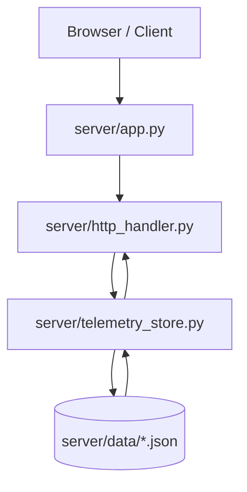
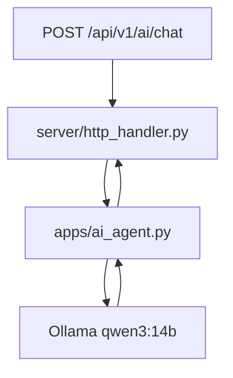
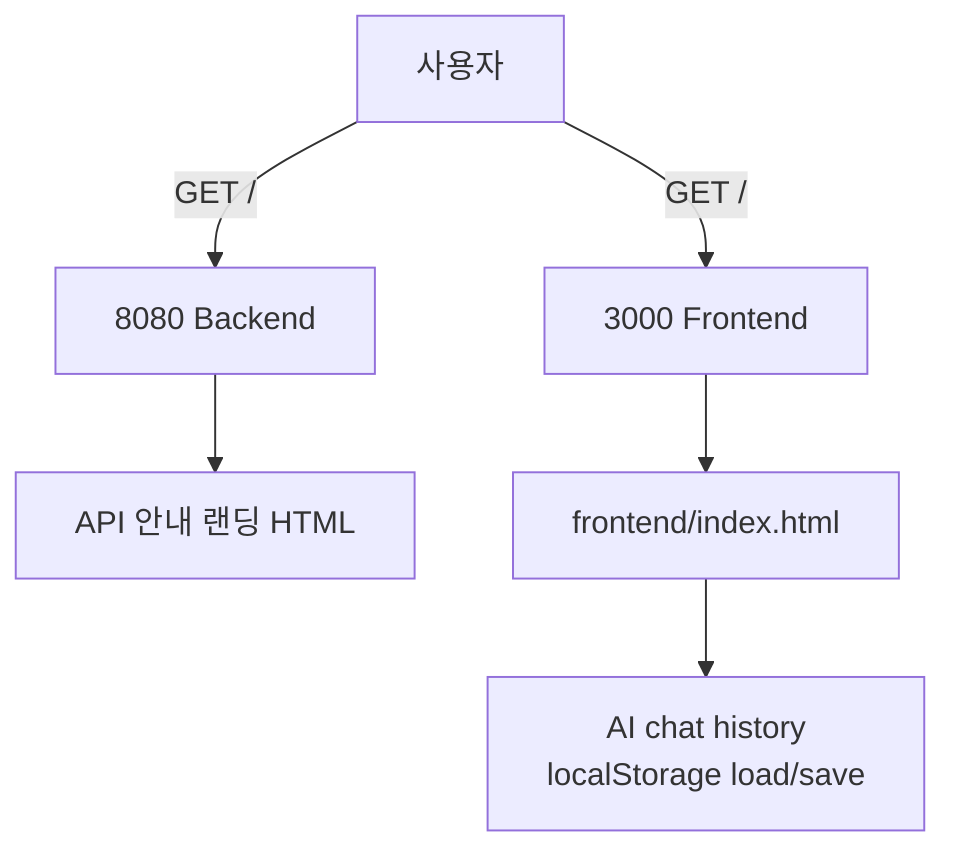
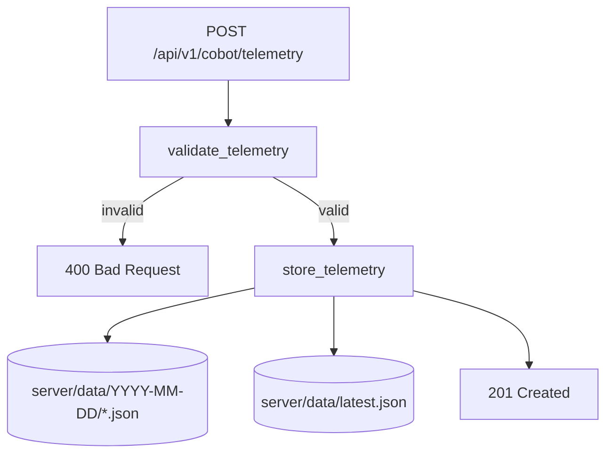
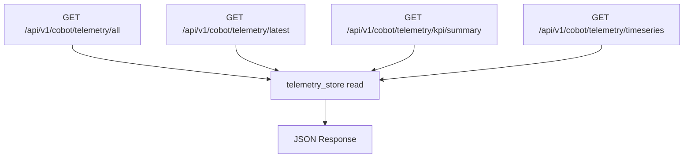
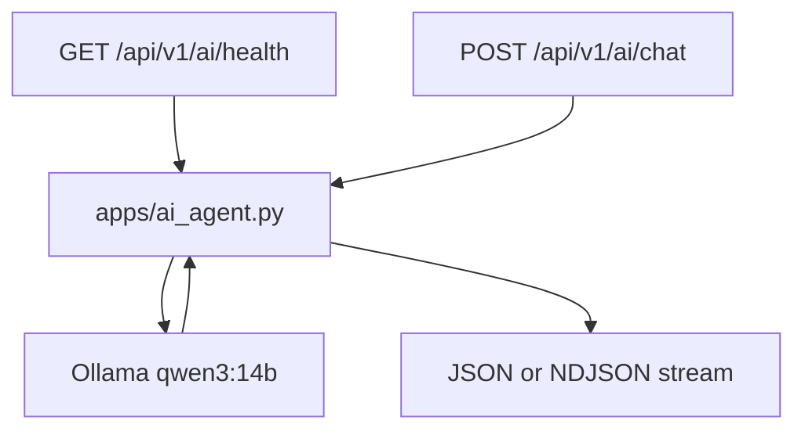

# Server Pipeline

`server`는 `8080`에서 JSON API를 제공합니다. UI는 `3000` 정적 서버에서 제공합니다.

## 실행 흐름



AI 요청은 아래 흐름을 추가로 탑니다.



## 파일별 책임

| 파일 | 담당 |
| --- | --- |
| `app.py` | 서버 실행 진입점, `ThreadingHTTPServer` 시작 |
| `http_handler.py` | 라우팅, JSON/NDJSON 응답, AI API 연결 |
| `telemetry_store.py` | telemetry 검증, 파일 저장, 조회, KPI/시계열 계산 |
| `settings.py` | 경로, 필수 필드, logger 설정 |
| `data/` | 저장된 telemetry JSON과 `latest.json` |

## 주요 요청 흐름

### 화면



### 저장



### 조회



### AI



프런트 AI 화면은 대화 히스토리를 브라우저 `localStorage`에 저장하며, 재접속 시 자동 복원합니다(최대 100개 메시지).

AI 모델 기본값은 `qwen3:14b`입니다.

## 실행

```bash
python3 server/app.py --host 127.0.0.1 --port 8080
```

API 접속: `http://localhost:8080/`
